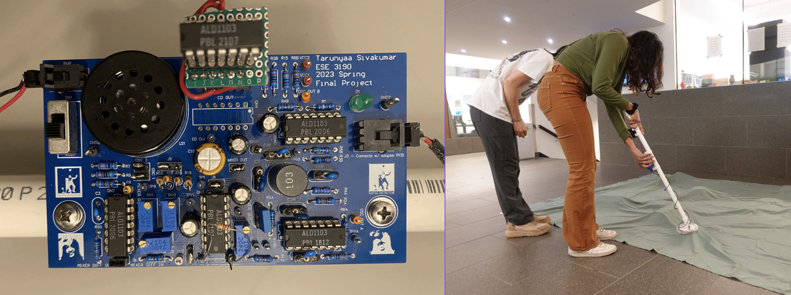

|[Home](https://tarunyaa.github.io) 🏠    [neuro42 Projects](https://tarunyaa.github.io/neuro42-projects/) 📡     [Physics Projects](https://tarunyaa.github.io/physics-projects/) 🔭     [Science Communication Projects](https://tarunyaa.github.io/science-communication-projects/) 🗣  |

## Penngineering Projects 🦾

### Metal Detector 🤘
*A working metal detector was designed, simulated, built and demonstrated from scratch, as part of the ESE 3190 Final Project.*

Oscillators were used to produce output sinusoidal waveforms whose frequency difference, w1-w2, increased as a function of the proximity of the metal to the detector. A mixer combined the oscillation frequencies into one signal, a CS amplifier produced different mathematical combinations of the oscillation frequencies, including the frequency difference, w1-w2, which was filtered by a low pass filter, amplified by the driver and outputted by the speaker.

Multiple simulations were conducted on LTSpice and the different stages of the metal detector circuitry were breadboarded in previous labs before the layout of the components on Altium was done for the creation of a printed circuit board (PCB). 

> | Skills: PCB Design & Assembly, Altium Designer, LTSpice, Oscilloscope | [Final Report](https://docs.google.com/document/d/1lSRqYki_kLG4mkxcrpkX_QWUJBbK84d-gT7Wg24nhkQ/edit?usp=sharing) |

### Hand-Powered Hand ✋
*An animatronic hand was made that mimics the gestures of a human hand and communicates with it wirelessly, as part of the ESE 3500 Final Project.*

This involved three parts.
1. Sensing i.e. measuring accurate readings of the motion of the human hand using a glove integrated with flex sensors and the Arduino's ADC.
2. Actuation i.e. the corresponding movement of a mechanically designed hand using servo motors.
3. Wireless i.e. involves transmission between the Arduino attached to the glove and the mechanical hand using nrf24L01 modules.
In all, the project hopes to prove useful in applications where human hands cannot be used in hazardous situations, telecommunications, and physical disability. 

> | Skills: C, Microcontrollers, Wireless Communication, Mechanical Design | [Github](https://github.com/tarunyaa/handpoweredhand) |

### Coupled Learning Neural Network 🧠
> | Skills: PCB Design & Assembly, Altium Designer |

### Closed-Loop Holographic Control of Nanorobots 🤖
*Nanorobots were holographically illuminated and controlled in the field of view of a spatial light modulator (SLM) using a laser 🚨 and microscope 🔬. This was my project during my summer at Miskin Labs.*

This involved three parts.
1. Investigating the Gerchberg-Saxton Algorithm for the retrieval of phase information from intensity measurements and enabling the patterning of laser light.
2. Using span Computer Vision (OpenCV package) to identity nanorobots.
3. Fixing alignment issues between the DSLR and SLM frame using matrix transformations, to shine light precisely on the nanorobots.

> | Skills: Python, OpenCV, Optics, Spatial Light Modulator | [APS Meeting Abstract](https://meetings.aps.org/Meeting/MAR23/Session/Y10.5) |

### Pong 🏓
*Pong is one of the first ever computer games 🎮 created. It's quite simple - two paddles and a ball and the goal is to defeat the opponent by making them lose the ball. This was made as part of a ESE 3500 lab.*

A LCD screen 🖥 is programmed using an Arduino Uno and SPI, and its graphics library is written with the help of some given .h files. A buzzer, joystick, LEDs, and a logic level shifter is also used. The NodeMCU board is used for wireless control of the joystick.

> | Skills: C, Microcontrollers | [Github](https://github.com/tarunyaa/pong) |

### Theremin 🎵
*Theremin is an electronic musical 🎶 instrument controlled without physical contact by the performer, and in this case, controlled by the distance of the user's hand 🖐 from an ultrasonic sensor. This was made as part of a ESE 3500 lab.*

Input capture was used to measure distance and hence pulse width. Timers, PWM, ADC and output compare was used to generate music of different frequencies through the buzzer. A photoresistor was added to control volume with light, and both continuous and discrete modes of operation were implemented.

> | Skills: C, Microcontrollers | [Github](https://github.com/tarunyaa/theremin) |

### Morse ┉┉
*Morse code signals was translated to its alphanumeric representation. This was made as part of a ESE 3500 lab.*

Button presses and the duration of press was monitored using polling or interrupts then translated into dots and dashes using timer overflows. The message was converted to ASCII and displayed on a serial port. LEDs were also lit up based on whether a dot or a dash was received.

> | Skills: C, Microcontrollers | [Github](https://github.com/tarunyaa/morse) |

### VoluVision 👀
*VoluVision is a full-colored volumetric 3D display that will revolutionize surgical visualization. YPrize Finalists 2023.*

Based on IP from the University of Pennsylvania, the display’s pixels are microflyers - nanocarboarded polymer films of 0.25 mm diameter with payloads of colored microLEDs. These microflyers levitate to various altitudes upon incident laser light of 10 Suns intensity that has been patterned by a spatial light modulator (SLM). Their mechanism for levitation is photophoretic and is researched by the Bargatin group (we have their permission to use their technology). This is all packaged in a glass vacuum chamber to enable low pressures and prevent the laser light from escaping the box's coated polarizer. 

> | Skills: Team Management, Market Research, Engineering Design |
